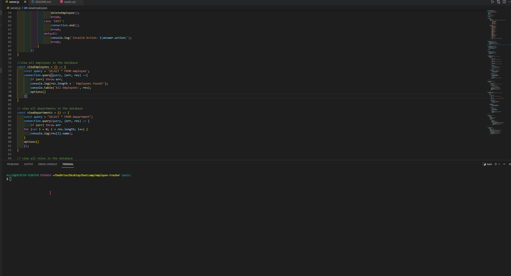

## Title
Employee-Tracker

## Table of contents
- [Title](#title)
- [Table of contents](#table-of-contents)
- [Description](#description)
- [Installation](#installation)
- [Usage Information](#usage-information)
- [Video](#video)

## Description
The application which show all the employee with their role, salary and their department from database.

## Installation
need to clone first the project then need to perform 'npm i', and after that run 'node server.js' or npm start on terminal.

## Usage Information
Usefull to view all the employee from database

## Video
